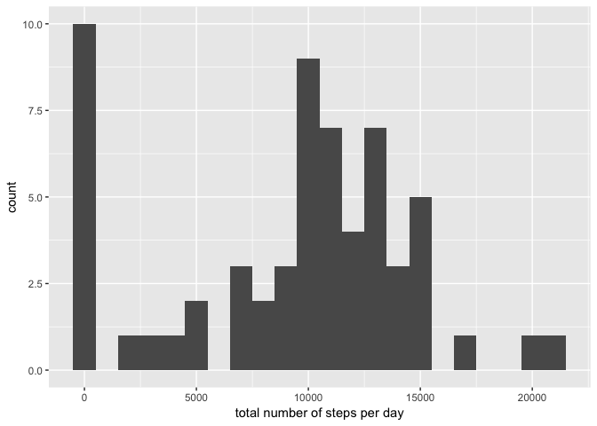
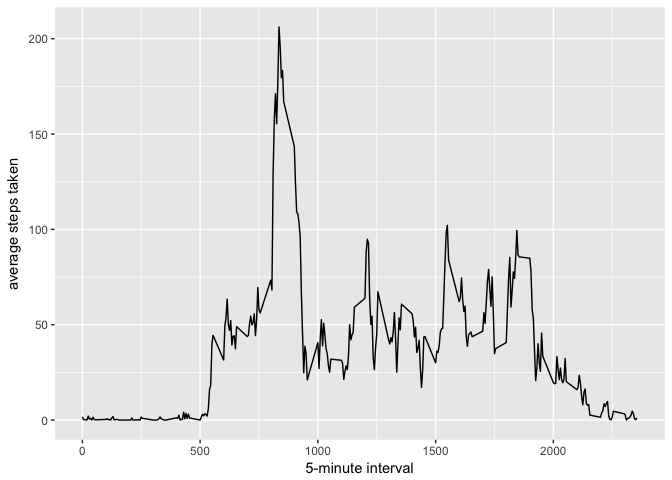
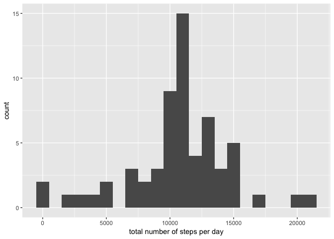
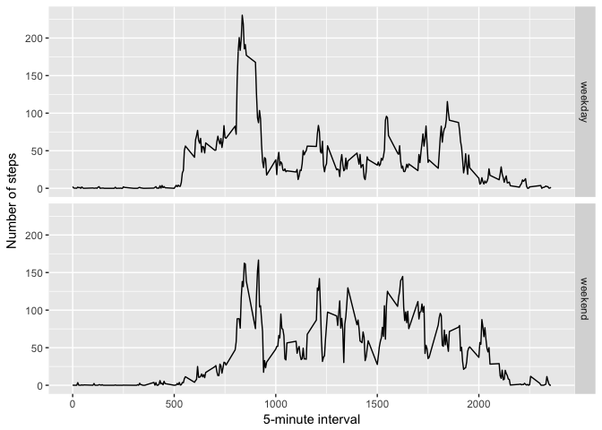

## Background

This assignment makes use of data from a personal activity monitoring device. This device collects data at 5 minute intervals through out the day. The data consists of two months of data from an anonymous individual collected during the months of October and November, 2012 and include the number of steps taken in 5 minute intervals each day.

The data consists of a zip file that can be used for the purpose of this exercise

# Loading and preprocessing the data

```r
unzip(zipfile = "activity.zip")
activityData <- read.csv("activity.csv")
```

## What is mean total number of steps taken per day?
To calculate the mean total number of steps per day, it helps to get the total number of steps, use an histogram to see the distribution and then calculate the mean

```r
library(ggplot2)
total_steps <- tapply(activityData$steps, activityData$date, sum, na.rm = TRUE) 
qplot(total_steps, binwidth = 1000, xlab = "total number of steps per day")
```

<!-- -->

```r
mean(total_steps, na.rm = TRUE)
```

```
## [1] 9354.23
```

```r
median(total_steps, na.rm = TRUE)  
```

```
## [1] 10395
```

## What is the average daily activity pattern?

A time series will paint the right picture for the daily activity pattern. First, one needs to get the average number of steps per interval...

```r
averages <- aggregate(x = list(steps = activityData$steps), by = list(interval = activityData$interval), 
                      mean, na.rm = TRUE)
ggplot(data = averages, aes(x = interval, y = steps)) + geom_line() + xlab("5-minute interval") + 
      ylab("average steps taken")
```

<!-- -->


The average daily patterns tends to spike at one point of the day with much less variation for the rest of the day

The interval containing the maimum number of steps follows:

```r
averages[which.max(averages$steps), ]
```

```
##     interval    steps
## 104      835 206.1698
```
## Imputing missing values

Using a function, the missing values can be replaced by the mean of that interval


```r
missings <- sum(is.na(activityData$steps))
missings
```

```
## [1] 2304
```

```r
fill.value <- function(steps, interval) {
      filler <- NA
      if (!is.na(steps)) {
            filler <- c(steps)  
      } else {
            filler <- (averages[averages$interval == interval, "steps"])
      }
      return(filler)
}  
filler.activityData <- activityData
filler.activityData$steps <- mapply(fill.value, filler.activityData$steps, filler.activityData$interval)  

total.steps <- tapply(filler.activityData$steps, filler.activityData$date, sum)
qplot(total.steps, binwidth = 1000, xlab = "total number of steps per day")
```

<!-- -->

```r
mean(total_steps)
```

```
## [1] 9354.23
```

```r
median(total_steps)
```

```
## [1] 10395
```

## Are there differences in activity patterns between weekdays and weekends?


```r
type_of_day <- function(date) {
      day <- weekdays(date)
      if (day %in% c("Monday", "Tuesday", "Wednesday", "Thursday", "Friday")) {
            return("weekday")   
      } else{
            return("weekend") 
      }
            
}
filler.activityData$date <- as.Date(filler.activityData$date)
```

```
## Warning in strptime(xx, f <- "%Y-%m-%d", tz = "GMT"): unknown timezone
## 'default/America/New_York'
```

```r
filler.activityData$day <- sapply(filler.activityData$date, FUN = type_of_day)

averages <- aggregate(steps ~ interval + day, data = filler.activityData, mean)
ggplot(averages, aes(interval, steps)) + geom_line() + facet_grid(day ~ .) + 
      xlab("5-minute interval") + ylab("Number of steps")
```

<!-- -->
  
During the week the subject tends to be more active
